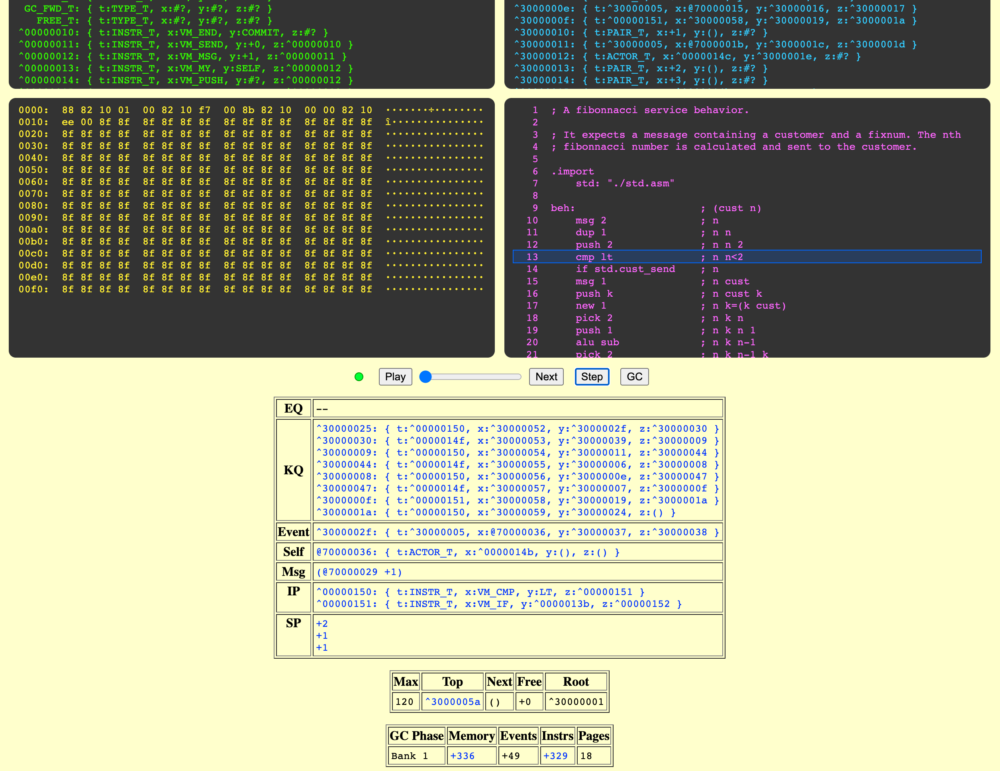

# μFork

A pure-actor virtual machine with object-capabilities and memory-safety.
The **uFork** processor architecture features
instruction-level concurrency,
automatic memory-management,
and fine-grained resource limits.


The blog post
"[Memory Safety Simplifies Microprocessor Design](http://www.dalnefre.com/wp/2022/08/memory-safety-simplifies-microprocessor-design/)"
describes the high-level architecture,
and the rationale behind it.



## Implementations

The initial prototype
was [implemented in **C**](https://github.com/organix/ufork-c)
and hosts a Scheme REPL with actor extensions.

The [Rust/WASM version](vm/wasm/README.md)
is a newer and more-robust implementation.
Multiple instances of the WASM component
can be instantiated to simulate a multi-core
or distributed system.

An FPGA implementation is planned for the future.

### Technology Stacks

```
+-----+--------+-------+-------+---------+-------------+
| ASM | Scheme | Humus | Misty | ...     | Scheme REPL |
|-----+--------+-------+-------+---------|-------------|
| uFork-CRLF intermediate representation | uFork VM    |
|========================================|=============|
| Rust (no-std)                | Verilog | C           |
|------+-----+--------+--------|---------|-------------|
| WASM | ARM | RISC-V | Xtensa | FPGA    | Host O/S    |
+------+-----+--------+--------+---------+-------------+
```

The C proof-of-concept was built to run
in a traditional hosted O/S environment,
and does not track the evolving semantics
of the uFork IR (intermediate representation).

The Rust implementation (and eventually the Verilog)
conforms to a common uFork IR semantics.
The Rust code-base currently targets WASM,
but it should be possible to compile the core
for a variety of other Rust target platforms.
The future Verilog implementation
will target small FPGA devices
as a secure soft-core processor.

There is currently an assembler
that generates uFork IR
from a textual ASM format.
A compiler for a dialect of Scheme
with actor-oriented extensions
also generates uFork IR.
A univeral linker/loader
produces uFork memory images
from uFork IR.
Modules in uFork IR
can import and export symbols
regardless of their original source language.
Additional languages can be supported
by generating interoperable uFork IR.

## Documentation

  * uFork [Project Summary](docs/summary.md)
  * uFork [Virtual Machine](docs/ufork.md) description
  * [Actor Protocol Design](docs/proto.md) in uFork
  * [Object Capabilities](docs/ocaps.md) in uFork
  * Linker/loader [Intermediate Representation](docs/ir.md) specification
  * [Assembly Language](docs/asm.md) reference manual
  * [LISP/Scheme compiler](docs/scheme.md) reference manual
  * [Actor Wire Protocol (AWP)](docs/awp.md) specification
  * [AWP Network](docs/awp_device.md) device description
  * [Virtual Machine](docs/vm.md) implementation details
  * [Sponsor](docs/sponsor.md) semantics
  * [Console Input/Output](docs/io_dev.md) device description
  * [Binary Large-Object (blob)](docs/blob_dev.md) device description
  * [Garbage-collected](docs/gc.md) memory management

## License

[Apache License](LICENSE), Version 2.0

## Project Support


[This project](https://nlnet.nl/project/uFork/)
was funded through the [NGI0 Entrust](https://nlnet.nl/entrust) Fund,
a fund established by [NLnet](https://nlnet.nl/) with financial support from
the European Commission's [Next Generation Internet](https://ngi.eu/) programme,
under the aegis of DG Communications Networks,
Content and Technology under grant agreement N<sup>o</sup> 101069594.
