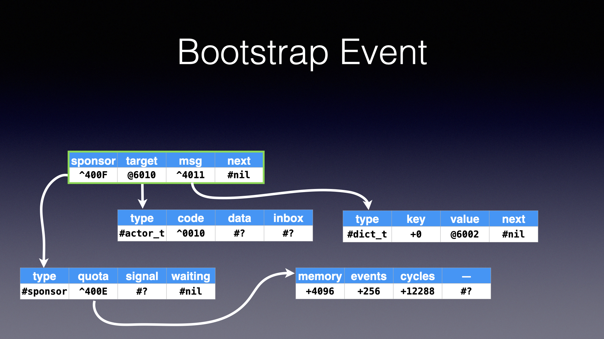
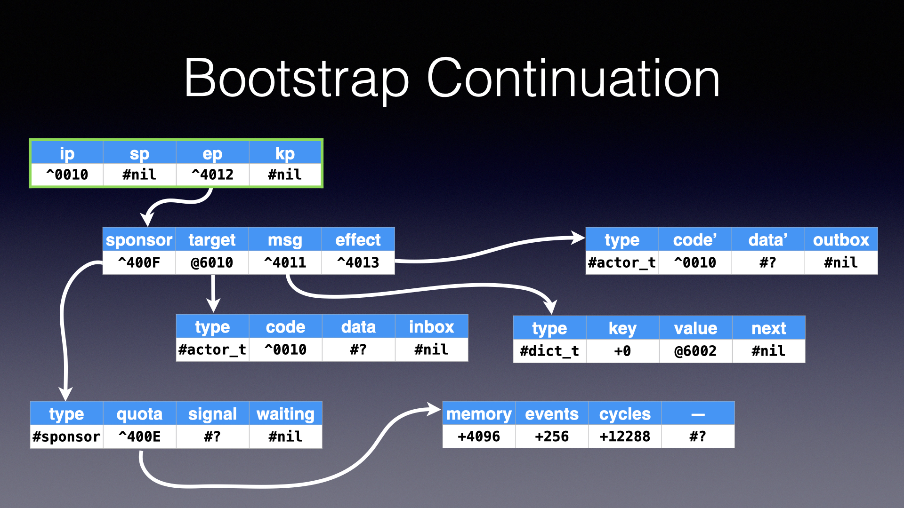

# Bootstrap Procedure

The [μFork Processor](vm.md) begins with a known image
in the first 16 quads of both ROM and RAM.
The ROM contains important constant values.
The RAM contains important processor-managed data structures.
The user code and data begins after the reserved area in ROM.

The address `^0010` (in ROM) must contain the code
for the bootstrap actor.
The processor creates the bootstrap actor,
the bootstrap message, and the bootstrap event (all in RAM).
The bootstrap message contains
a dictionary of device capabilities.
The [sponsor](sponsor.md) of the bootstrap event
is the root sponsor of the processor.
The bootstrap event is added to the event queue,
and the dispatch loop of the processor begins.

When the [event scheduler](scheduler.md)
dispatches the bootstrap event,
the processor creates an empty effect
(marking the bootstrap actor "busy")
and creates the bootstrap continuation.
The bootstrap continuation is initialized
with the instruction pointer (`ip`)
pointing to the bootstrap actor's code,
the stack pointer (`sp`)
pointing to an empty stack,
and the event pointer (`ep`)
pointing to the bootstrap event.
The bootstrap continuation is added
to the continuation queue,
which allows the dispatch loop
to begin executing instructions
processing the bootstrap event.

If the continuation queue is not empty,
the processor's dispatch loop will execute an instruction
from the continuation at the head of the queue.
All of the information needed to execute an instruction
is reachable through the continuation.
It represents the entire execution context.
When the instruction is completed,
the updated continuation is moved
to the tail of the continuation queue.
When an `end` instruction is executed
(`commit` or `abort`),
the event-processing transaction ends,
the target actor is marked "ready",
and both the event and continuation are discarded.
