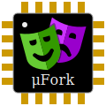

# μFork/FPGA soft-core processor

A novel microprocessor architecture
based on dispatching immutable asynchronous message-events
to reactive objects (actors) which manage private mutable state.
Contention for shared mutable storage is eliminated, reducing complexity.
Strong process and memory isolation prevents interference among tasks.
Object-capability security (ocaps) provides fine-grained access control.
The architecture has been validated by implementing a virtual-machine in software.
This sub-project implements the design using FPGA hardware
fully supported by open-source tooling.

The initial target hardware is the [Fomu](fomu/README.md),
which features a Lattice iCE40 UP5K FPGA.

## Project Support

[This project](https://nlnet.nl/project/uFork-FPGA/)
was funded through the [NGI0 Entrust](https://nlnet.nl/entrust) Fund,
a fund established by [NLnet](https://nlnet.nl/) with financial support from
the European Commission's [Next Generation Internet](https://ngi.eu/) programme,
under the aegis of DG Communications Networks,
Content and Technology under grant agreement No 101069594.
