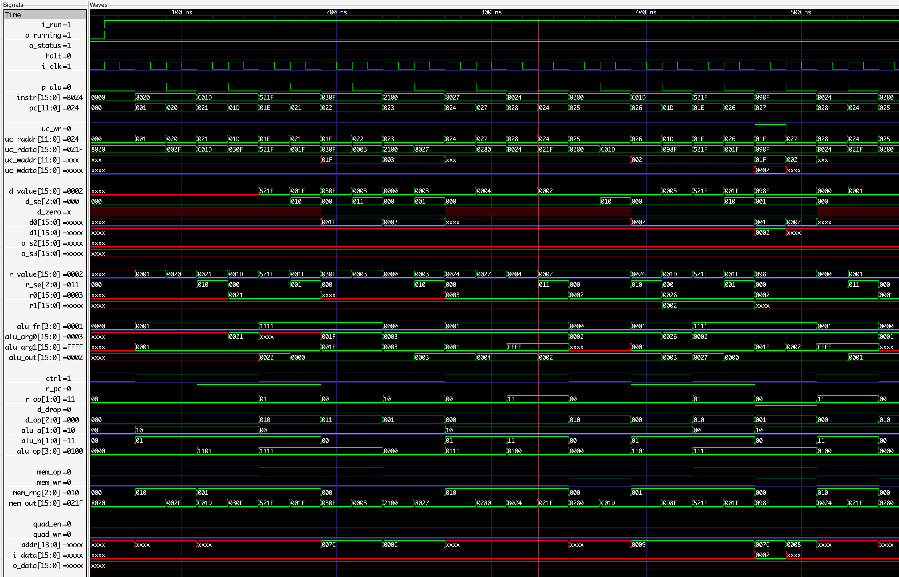

# uCode/Forth Processor

The sources in this directory
implement a Forth-oriented processor
that serves as the microcode machine
for implementing uFork instructions.
Programs for the machine
are written in [Forth](https://en.wikipedia.org/wiki/Forth_(programming_language)).
Considerable inspiration was taken from
the [`J1`](https://www.excamera.com/files/j1.pdf) CPU and
[`J1a SwapForth`](https://github.com/jamesbowman/swapforth/tree/master/j1a).

## Documentation

  * [uCode processor design](cpu.md)
  * [uCode Forth programming language](ucode.md)
  * [Interactive hardware monitor](monitor.md)

## Sample CPU Trace (Simulated)

## Build and Deploy

We use a `Makefile` to define the build process.

To build the bitstream (packaged as a `dfu` file):

    make

On power-up the Fomu runs the DFU boot-loader.
To deploy the bitstream to the Fomu:

    make install

To remove the build artifacts,
forcing everything to be rebuilt from source:

    make clean

## Serial UART Device

This example includes a [serial](https://en.wikipedia.org/wiki/Asynchronous_serial_communication)
[UART](https://en.wikipedia.org/wiki/Universal_asynchronous_receiver-transmitter) device.
It operates at a fixed [baud rate](https://en.wikipedia.org/wiki/Baud) of 115200
with [8N1](https://en.wikipedia.org/wiki/8-N-1) framing and parity.

The user i/o pads of the Fomu are assigned as follows
(starting from the side with the notch):

  1. GND -- Common Ground
  2. TX -- Transmitted Data
  3. RX -- Received Data (w/ pull-up if not connected)
  4. PWR -- 3v3 Level (do not connect)

Connections between the Fomu and Host must be cross-wired
as a [Null Modem](https://en.wikipedia.org/wiki/Null_modem).

    Fomu              Host
    -----+          +-----
     GND |----------| GND
         |          |
         |          |
      TX |---+  +---| TX
         |    \/    |
         |    /\    |
      RX |---+  +---| RX
    -----+          +-----

Signals are expected to be LVCMOS levels.
Note that a serial line is held high when idle
and transitions to low to indicate the start
of a new character (octet).

### Serial Terminal Program

You'll have to run a serial terminal program
to communicate with the serial device.

On a Mac, determine the available devices like this:

    ls /dev/tty.*

Then run the `screen` program to connect
to the serial port at your desired baud-rate.

    screen /dev/tty.usbserial-AD0JIXTZ 115200

Use the key sequence `Ctrl-a + k` to kill the terminal session.

## uCode Programming Tools

Various JavaScript-based tools are available
to support uCode program development.

### Command-line Tools

To compile uCode/Forth source into a memory-image file
for inclusion into Verilog designs.

    deno run ucode_cli.js <ucode.f >ucode_rom.mem

To run uCode in a simulator of the uCode machine,
with console i/o connected to the simulated UART.

    deno run --allow-read ucode_sim_cli.js ucode.f

The simulator can also load and run a memory-image file.

    deno run --allow-read ucode_sim_cli.js ucode_rom.mem

### Web-based Tools

If the [Replete server](https://github.com/organix/uFork#how-to-run) is running,
an interactive uCode debugger is available.

[http://localhost:3675/fpga/fomu/cpu/ucode_dbg.html]()

Paste your uCode/Forth source program into the _Source_ panel
and hit the **Compile** button to generate a _Memory_ image.
The resulting program can be single-stepped
or run with a variable delay (default: none).
A breakpoint can be set (in hexadecimal)
which will pause before executing the instruction
at the specific `PC` (program counter) value.
Stack and memory contents are displayed at all times.
A simulated _Console I/O_ device is connected to
controls on the page.
