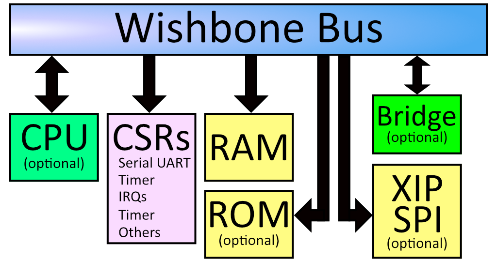

# uFork LiteX

An ongoing attempt to package the uFork FPGA design as a
[LiteX](https://github.com/enjoy-digital/litex) component.

The preliminary goal is to:
- build a LiteX design without a CPU
- configure it to use [Litescope](https://github.com/enjoy-digital/litescope)
  (basically an FPGA debugger)
  [Hint](https://github.com/enjoy-digital/litescope/issues/28)
- install on a Fomu
- blink an LED via Litescope

## How To Run

Run `nix-shell` from this directory. It will automatically install some LiteX
dependencies, pinned to working versions. If necessary, it will then run
`./update.sh` to install the latest version of LiteX.

LiteX can be updated by running `./update.sh`.

So far, it is possible to build and install a basic LiteX design by running

    litex_repos/litex-boards/litex_boards/targets/kosagi_fomu.py \
        --cpu-type None \
        --build

    dfu-util -D build/kosagi_fomu/gateware/kosagi_fomu.bin

Alternatively,
[a MicroPython image](https://workshop.fomu.im/en/latest/python.html) containing
a Wishbone USB bridge (see below) can be installed by running

    curl -L https://github.com/im-tomu/fomu-workshop/raw/master/micropython-fomu.dfu \
    | dfu-util -D -

## Observations

LiteX places every device, including RAM, on a Wishbone bus, at least for the
RISCV implementation. That could interfere with our ability to do single cycle
reads and writes from BRAM and SPRAM.

If the design contains a Wishbone USB bridge,
[it is possible](https://workshop.fomu.im/en/latest/riscv.html) to read and
write arbitrary memory locations using
[the `wishbone-tool` command](https://wishbone-utils.readthedocs.io/).
Unfortunately, `wishbone-tool` does not build on MacOS. However, a prebuilt
binary for Linux is
[available on GitHub](https://github.com/litex-hub/wishbone-utils/releases)
and can be run in a VM if necessary.
